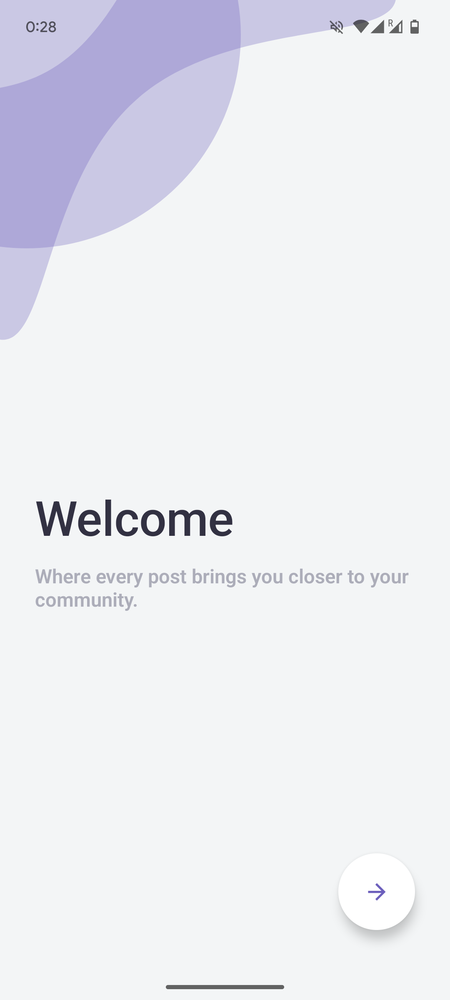
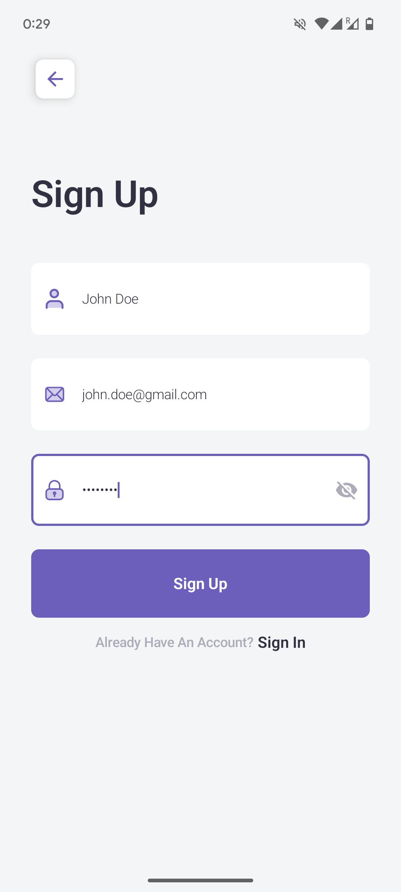
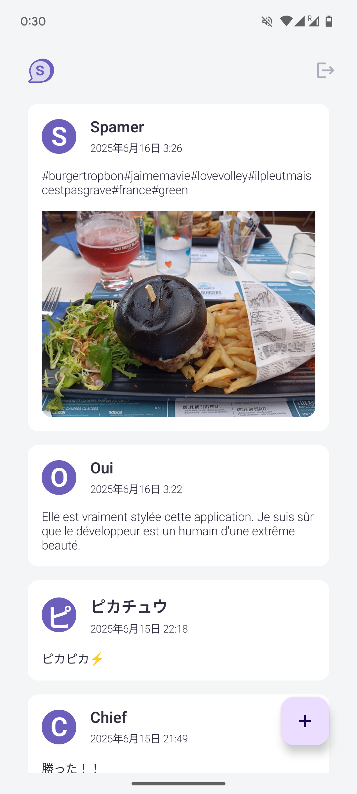
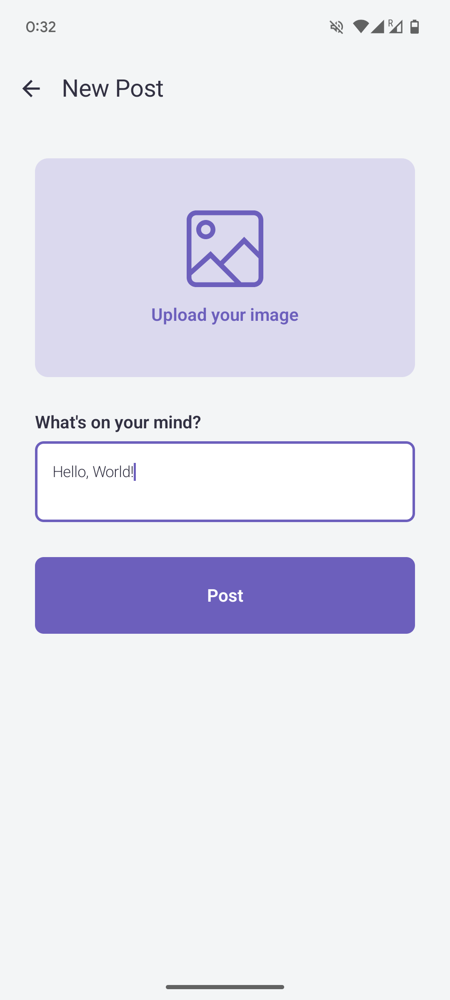

# 📱 Socially

**Socially** is a micro social media Android application inspired by Twitter Lite. Built with **Jetpack Compose**, **Kotlin**, and **Clean Architecture**, the app enables users to register, sign in, and share posts with optional images. It leverages Firebase for authentication, cloud storage, and Firestore database integration.

---

## ✨ Features

- 🔐 **Authentication**
  - Email/password sign-up and sign-in
  - Reset password functionality
- 🏠 **Timeline**
  - View paginated list of posts
  - Pull to refresh
  - Lazy loading of new pages
- 📝 **Post Creation**
  - Add text and/or image
  - Upload to Firebase Storage
- 👤 **User Management**
  - Sign out
  - Username and email validation

---

## 🖼️ Showcase

      

## 🧱 Tech Stack

### 🧩 Architecture
- MVVM
- Clean Architecture (Domain, Data, Presentation layers)
- UseCase-driven interaction

### 🛠 Libraries
- [Jetpack Compose](https://developer.android.com/jetpack/compose)
- [Hilt](https://developer.android.com/training/dependency-injection/hilt-android)
- [Firebase Auth / Firestore / Storage](https://firebase.google.com/)
- [Coil](https://coil-kt.github.io/coil/)
- [Kotlin Coroutines + Flow](https://kotlinlang.org/docs/flow.html)
- [MockK](https://mockk.io/) for unit testing

## 📁 Project Structure

```
app/
├── common/
│   ├── auth/          # Shared auth logic
│   ├── components/    # Reusable UI states
│   ├── di/            # Hilt definition
│   ├── utils/         # Validation, resource wrappers
├── login/
│   ├── presentation/  # Login UI & ViewModels
├── timeline/
│   ├── data/          # Firebase-backed repository
│   ├── domain/        # Post models & UseCases
│   ├── presentation/  # Timeline UI & ViewModels
└── test/              # All test classes organized by feature
```

---

## 🧪 Running Tests

```bash
# Run unit tests
./gradlew testDebugUnitTest
```

Test reports are available under:
```
app/build/reports/tests/testDebugUnitTest/index.html
```

---

## 🚧 Possible Improvements

- User profile and avatar support
- Post likes/comments
- Dark mode toggle
- Offline caching with Room or DataStore
- ... and many more...

---

## 🔒 Disclaimer

This project is for demonstration and testing purposes only. Firebase security rules and production-hardening have been kept minimal to focus on architectural clarity and unit testing practices. 

---

## 🧑‍💻 Author

**Nicolas Zurbuchen**  
Android Software Engineer based in Nagoya, Japan  
Contact: [nicolas.zurbuchen@outlook.com](mailto:nicolas.zurbuchen@outlook.com)
